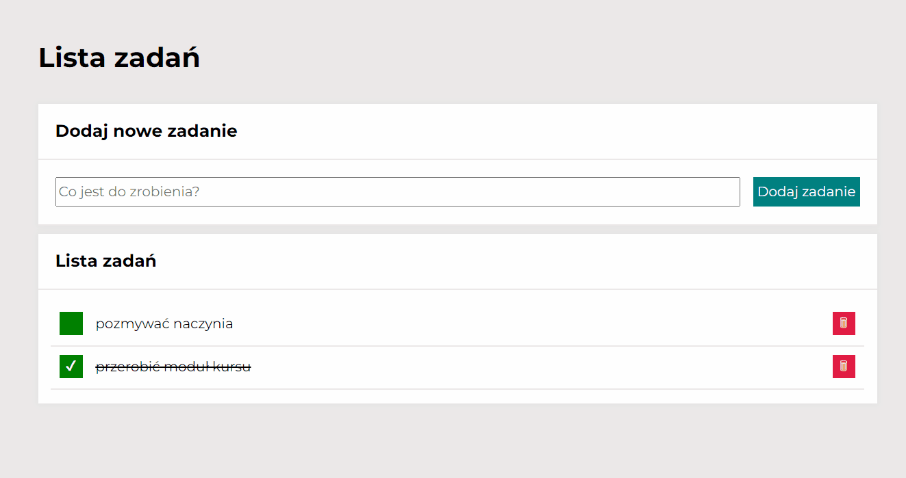

# To-Do List - web app
To-Do List is a simple app that allows to create and manage list of daily tasks. Why not weekly or better-montly? Because this is just a prototype of the app, unfortunately data is not storaged, so after refreshing all created tasks will be gone.

## Table of content 
* [Demo](#demo)
* [Functionality](#functionality)
    * [Adding a task](#adding_a_task)
    * [Marking a task as done](#marking_a_task_as_done)
    * [Deleting a task](#deleting_a_task)
    * [Hiding/showing done tasks](#hiding/showing_done_tasks)
    * [Marking all tasks as done](#marking_all_tasks_as_done)
* [Technologies](#technologies)

## Demo
Link to the app: [To-Do List](https://weronikabrozek.github.io/To-Do-List/)

## Functionality
This simple app allows to create a list of tasks in a very easy way. The functionality of the app consist following parts:
* adding a task
* marking a task as done
* deleting a task
* hiding/showing done tasks
* marking all tasks as done
## Technologies
* HTML (BEM),
* CSS (Flex)
* Java Script,