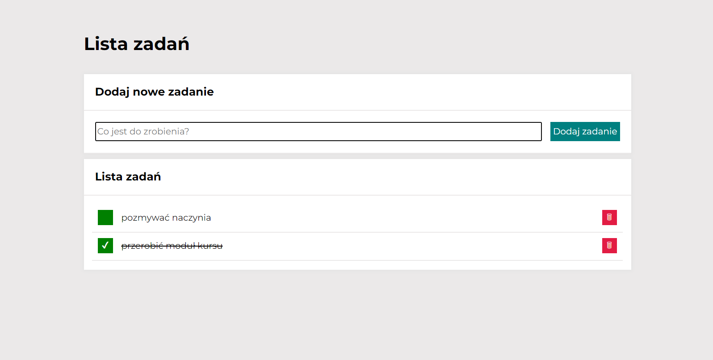

# To-Do List - web app
To-Do List is a simple app that allows to create and manage list of daily tasks. Why not weekly or better-montly? Because this is just a prototype of the app, unfortunately data is not storaged, so after refreshing all created tasks will be gone.

## Table of content 
* [Demo](#demo)
* [General info](#general_info)
* [Example of use](#example_of_use)
* [Technologies](#technologies)

## Demo
Link to the app: [To-Do List](https://weronikabrozek.github.io/To-Do-List/)

## General info
This simple app allows to create a list of tasks in a very easy way. The functionality of the app consist of three parts:
* adding a task
* marking a task as done
* deleting a task

## Example of use

## Technologies
* HTML (BEM),
* CSS (Flex)
* Java Script,